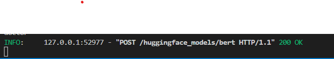

**ToDo:**
- 
- [x] Fix images
- [x] Continue ## How to add a new model?

# API - creation and deployment

- [API - creation and deployment](#api---creation-and-deployment)
  - [API setup](#api-setup)
  - [How to run API?](#how-to-run-api)
  - [API creation](#api-creation)
  - [How to add a new model?](#how-to-add-a-new-model)


## API setup

Install all project requirements with `pip`:

```bash
pip install -r requirements.txt
```

## How to run API?

We'll be using Uvicorn, a fast ASGI server (it can run asynchronous code in a single process) to launch our application. Use the following command to start the server:

```bash
uvicorn app.api:app \
    --host 0.0.0.0 \
    --port 5000 \
    --reload \
    --reload-dir app \
    --reload-dir models
```
Or
```
uvicorn app.api:app  --host 0.0.0.0 --port 8000  --reload  --reload-dir deploy-GAISSA --reload-dir app 
```
In detail:

- `uvicorn app.api:app` is the location of app (`app` directory > `api.py` script > `app` object);
- `--reload` makes the server reload every time we update;
- `--reload-dir app` makes it only reload on updates to the `app/` directory;
- `--reload-dir models` makes it also reload on updates to the `models/` directory;

**Observation**. If we want to manage multiple `uvicorn` workers to enable parallelism in our application, we can use **Gunicorn** in conjunction with **Uvicorn**.

<center><figure>
  </center>
<p style="text-align: center;">API running.</p>


Now you can test the app:

We can now test that the application is working. These are some of the possibilities:

- Visit [localhost:5000](http://localhost:5000/)
- Use `curl`

  ```bash
  curl -X GET http://localhost:5000/
  ```

- Access the API programmatically, e.g.:

  ```python
  import json
  import requests

  response = requests.get("http://localhost:5000/")
  print (json.loads(response.text))
  ```

- Use an external tool like [Postman](https://www.postman.com), which lets you execute and manage tests that can be saved and shared with others.

Visit [Swagger UI](http://localhost:5000/docs) for documentation endpoint and select one of the models. The documentation generated via [Redoc](https://github.com/Redocly/redoc) is accessible at the `/redoc` endpoint.


<center><figure>
  </center>
<p style="text-align: center;">API User Interface in localhost:5000/docs endpoint.</p>


To make an inference, click on the "Try it out" button and click execute.

You should obtain a "200" code response after executing the POST method of the model:

<figure>
  
<p style="text-align: center;">API response on Swagger UI.</p>


<center><figure>
  </center>
<p style="text-align: center;">API response on terminal.</p>


## API creation
The API in this project is freely inspired by the [Made with ML](https://madewithml.com) tutorial: "[APIs for Machine Learning](https://madewithml.com/courses/mlops/api/)" and [FastAPI Lab](https://github.com/se4ai2122-cs-uniba/SE4AI2021Course_FastAPI-demo).

Following the guide https://madewithml.com/courses/mlops/api/

## How to add a new model?
``
1. Add new model.
   File: [../app/models.py](../app/models.py)
   - Add a new class according to your new model, parent class is `Model()`.
   - Make sure `NewModel.predict()` method is implemented according to the model.
   - Add ML_task

2. Create schema.
   File: [../app/schemas.py](../app/schemas.py)
   - Create a schema with one example.
3. Add endpoint.
   File: [../app/api.py](../app/api.py)
   - According to the new model information (Model class and schema), add the endpoint to enable POST requests and make inference using the model.
