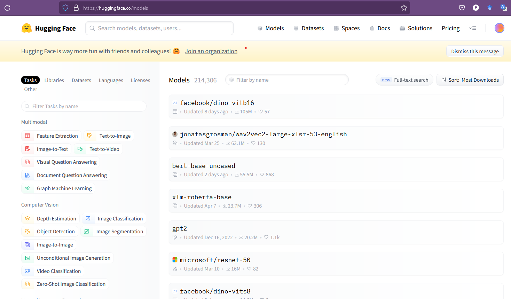
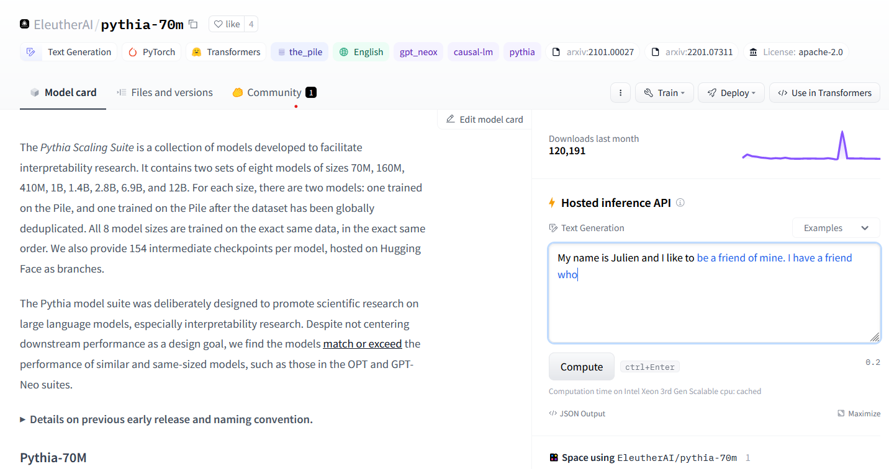
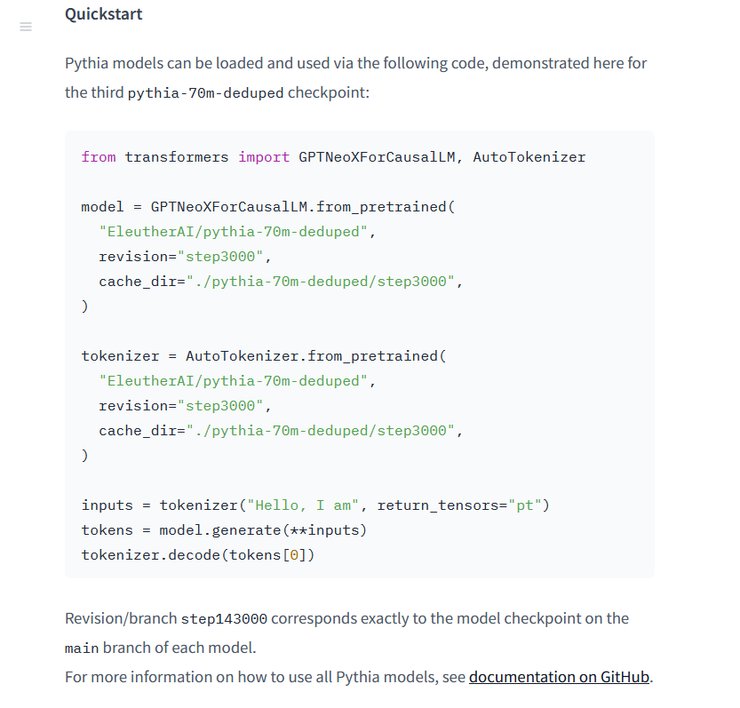
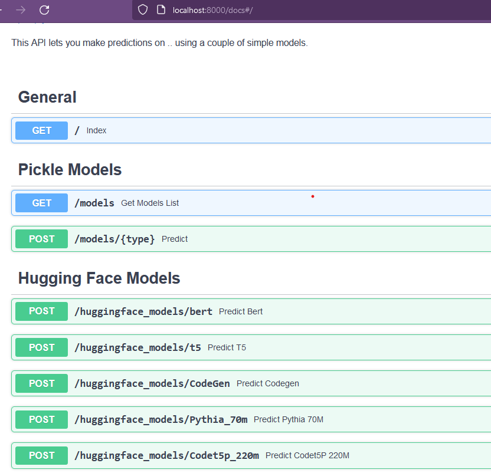
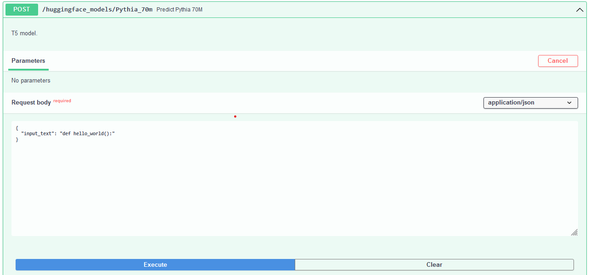
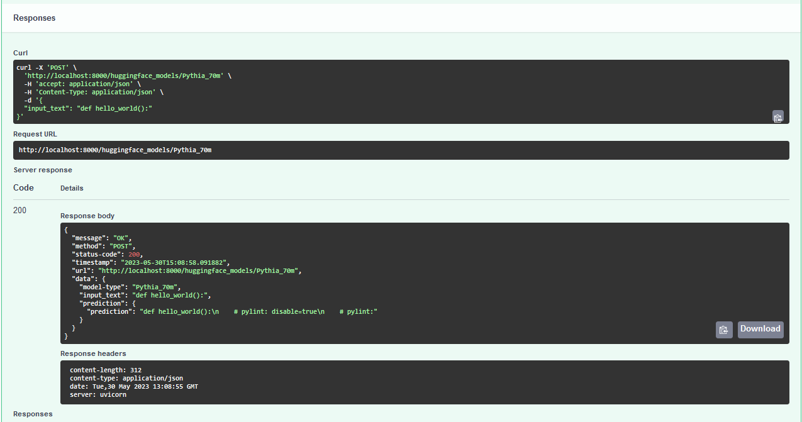
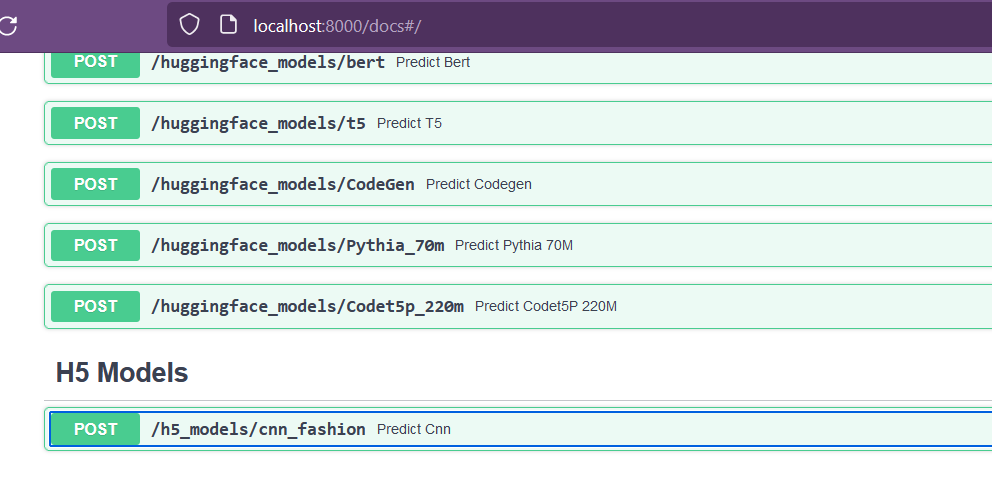
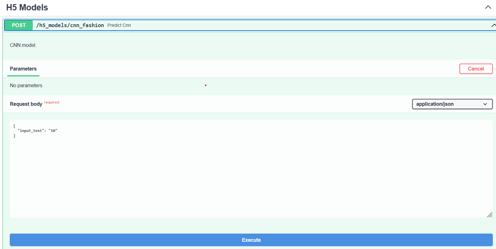
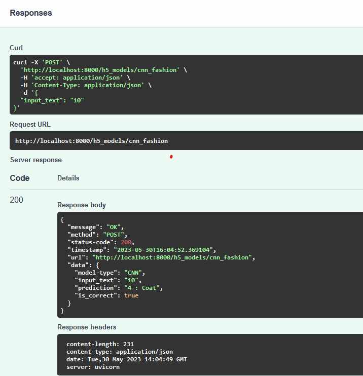

**ToDo:**

- [x] Add images
- [x] Info
- [x] Update references to this file
- [x] HuggingFace
- [x] hdf5

-------------
- [Add pretrained model](#add-pretrained-model)
  - [Add a pretrained Hugging Face model](#add-a-pretrained-hugging-face-model)
  - [Add a pretrained h5 (hdf5) model](#add-a-pretrained-h5-hdf5-model)
-------------
# Add pretrained model
Guide to add pretrained ML models (from Hugging Face, hdf5 format, pickle format) to do inferences through an API.

## Add a pretrained Hugging Face model

1. Select a Pretrained Model:
   - Choose a pretrained model from the [Hugging Face Model Hub](https://huggingface.co/models) that suits your task and language requirements. For example, you can choose models for text classification, named entity recognition, question answering, etc.

<center><figure>
  </center>
<p style="text-align: center;">Hugging Face Model Hub.</p>

2. In this case we will use the "Pythia-70m" model, a recent text and code generation model and developed by EleutherAI. See https://huggingface.co/EleutherAI/pythia-70m.

<center><figure>
  </center>
<p style="text-align: center;">Hugging Face: Pythia-70m by EleutherAI.</p>

3. Most of the models in HuggingFace have a 'Quickstart' section where you can see how to load the model and use it in a python script. In this type of models you need a model and a tokenizer to make inferences using it.

<center><figure>
  </center>
<p style="text-align: center;">Hugging Face: Pythia-70m code example.</p>

4. Load the Pretrained Model:
   - Use the Hugging Face library to load the pretrained model of your choice into your API code. You can use `pip` to install the `transformers` library.

5. Add new model class.
   File: [../app/models.py](../app/models.py)
   - Add a new class according to your new model, parent class is `Model()`. In this case we will add `Pythia_70mModel(Model)`.
   - Make sure `NewModel.predict()` method is implemented according to the model. See below the predict() method, it receives a string and returns a dictionary with the prediction.
     - Load model
     - Load tokenizer
     - Tokenize input
     - Inference using the loaded model and the input
     - Return prediction

    ```python
    class Pythia_70mModel(Model):
        """_summary_ Creates a Pythia model. Inherits from Model()

        Args:
            Model (_type_): _description_
        """

        def __init__(self):
            super().__init__(models_names.Pythia_70m, ML_task.CODE)
            
        def predict(self, user_input: str):
            
            model = GPTNeoXForCausalLM.from_pretrained(
            "EleutherAI/pythia-70m",
            revision="step3000",
            cache_dir="./pythia-70m/step3000",
            )

            tokenizer = AutoTokenizer.from_pretrained(
            "EleutherAI/pythia-70m",
            revision="step3000",
            cache_dir="./pythia-70m/step3000",
            )

            text = "def get_random_element(dictionary):"
            text = user_input
            inputs = tokenizer(text, return_tensors="pt")
            tokens = model.generate(**inputs)
            response = {
                "prediction" : tokenizer.decode(tokens[0]),
            }
            
            return response
    ```

6. Create a model schema.
   File: [../app/schemas.py](../app/schemas.py)
   - Create a schema with one example. See below example for Pythia-70m model.

    ```python
    class PredictPythia_70m(BaseModel):
        input_text: str

        class Config:
            schema_extra = {
                "example": {
                    "input_text": "def hello_world():",
                }
            }
    ```

7. Add endpoint.
   File: [../app/api.py](../app/api.py)
   - According to the new model information (Model Class and schema), add the endpoint to enable POST requests and make predictions using the model.
   - Here you need to create an instance of the Model, pass the user input to the `model.predict()` method and return the prediction in the response dictionary that the POST method will return.

    ```python
    @app.post("/huggingface_models/Pythia_70m", tags=["Hugging Face Models"])
    @construct_response
    def _predict_pythia_70m(request: Request, payload: PredictPythia_70m):
        """T5 model."""
        
        input_text = payload.input_text 
        print("Input text")
        print(input_text)

        model = Pythia_70mModel()
        print(f"Model: {model.name}")

        if input_text:
            prediction = model.predict(input_text)
            
            response = {
                "message": HTTPStatus.OK.phrase,
                "status-code": HTTPStatus.OK,
                "data": {
                    "model-type": model.name,
                    "input_text": input_text,
                    "prediction": prediction,
                },
            }
        else:
            response = {
                "message": "Model not found",
                "status-code": HTTPStatus.BAD_REQUEST,
            }
        return response
    ```


8.  Deploy and Test the API:
   - Deploy your API to a server or cloud platform such as GCP, AWS, or Azure. Test the API by sending requests with sample input to ensure it is functioning as expected.
   - See [manuals](../manuals/) to check our guides to create the API or deploy the API.
   - In this case we run the API using:
   - ```bash
       uvicorn app.api:app  --host 0.0.0.0 --port 8000  --reload  --reload-dir . --reload-dir app 
       ```
   - Go to the [Swagger UI](http://localhost:8000/docs)
   - Select the model and click on the 'Try it out' button. Note that the endpoint must previously be defined in api.py

<center><figure>
  </center>
<p style="text-align: center;">Swagger UI.</p>

<center><figure>
  </center>
<p style="text-align: center;">Execute prediction using Pythia-70m.</p>

   - Verify response

<center><figure>
  </center>
<p style="text-align: center;">Response using Pythia-70m.</p>

## Add a pretrained h5 (hdf5) model

1. Create a new directory for your API project called `models` and add here your pretrained model (h5 file).
2. Load the Pretrained Model:
   - Use the keras library to load the pretrained model in h5 format into your API code. You can use `pip` to install the `tensorflow.keras` library.
3. Add new model class.
   File: [../app/models.py](../app/models.py)
   - Add a new class according to your new model, parent class is `Model()`. In this case we will add `CNNModel(Model)`.
   - Make sure `NewModel.predict()` method is implemented according to the model. See below the `predict()` method, it receives a string and returns a dictionary with the prediction.
   - In this case, we are using a CNN model for Image Classification using Fashion-MNIST dataset. The input is a number from the user and inside the definition of predict() method, there is a process to select one input from a test set according to the input number, parse the image in order to have the input shape of the model and pass it to the model to get a prediction, which will be the output class.
     - Load model
     - Parse input to meet the input criteria
     - Inference using the loaded model and the input
     - Return prediction

    ```python
    class CNNModel(Model):
    """
    Creates a LM Bert model. Inherits from Model()
    """
    def __init__(self):
        super().__init__(models_names.CNN, ML_task.CV)
        
    def predict(self, user_input: str, n = 5):
        dataset = "fashion"
        label_names = {
            0: "T-shirt/top",
            1: "Trouser",
            2: "Pullover",
            3: "Dress",
            4: "Coat",
            5: "Sandal",
            6: "Shirt",
            7: "Sneaker",
            8: "Bag",
            9: "Ankle boot"
        }

        saved_model_dir = f"models/model_{dataset}.h5"

        # Get test set 
        fashion_mnist=keras.datasets.fashion_mnist
        (_, _), (x_test, y_test) = fashion_mnist.load_data()

        # load model
        try:
            print(saved_model_dir)
            model = keras.models.load_model(saved_model_dir)
            print("Model loaded correctly")
        except:
            print("There is a problem with the file path")
            
        def see_x_image(x,y,name=None,caption=True, save_dir="."):
            '''
            See image
            '''
            plt.figure()
            
            plt.imshow((x.reshape((28,28))).astype("uint8"))
            title=str(y)
            if name:
                title += " "+name
                plt.title(title)
            if caption:
                plt.title(title)
            print(save_dir)
            plt.savefig(save_dir+"/"+dataset+"_image"+ ".png")
            plt.axis("off")
        
        if int(user_input) <= len(x_test):
            ran = int(user_input)
            print(" User entered ",user_input)
        else:
        # Get random number between 0 and len(x_test)
            ran = random.randint(0, len(y_test))
            print("Using random")
            print(ran)
        print(f"label of selected input: {y_test[ran]}")
        #print(list(y_test[ran]).index(max(y_test[ran])))
        label_name = label_names[y_test[ran]]
        see_x_image(x_test[ran],y_test[ran],label_name,save_dir="./")

        # Inference
        # predict with that random
        x_test = x_test.reshape(-1, 28, 28, 1)
        print(x_test[ran:ran+1].shape)
        model_predict = model.predict(x_test[ran:ran+1])
        print(f"model_predict: {model_predict}")
        cat_pred = np.argmax(model_predict)
        print(f"argmax: {cat_pred}")

        label = f"{cat_pred} : {label_names[cat_pred]}"
        is_correct = False
        if y_test[ran] == cat_pred:
            is_correct = True
        
        print("Prediction: ",cat_pred)
        print("Prediction clothes: ", label_names[cat_pred])
        print("Correct label: ",y_test[ran])
        print(f"is_correct: ", is_correct)
            
        response = {
            "prediction": label,
            "is_correct": is_correct,
        }
        return response
    ```

4. Create a model schema.
   File: [../app/schemas.py](../app/schemas.py)
   - Create a schema with one example. See below example for CNN model.

    ```python
    class PredictCNN(BaseModel):
        input_text: str

        class Config:
            schema_extra = {
                "example": {
                    "input_text": "10",
                }
            }
    ```

5. Add endpoint.
   File: [../app/api.py](../app/api.py)
   - According to the new model information (Model Class and schema), add the endpoint to enable POST requests and make predictions using the model.
   - Here you need to create an instance of the Model, pass the user input to the `model.predict()` method and return the prediction in the response dictionary that the POST method will return.

    ```python
    @app.post("/h5_models/cnn_fashion", tags=["H5 Models"])
    @construct_response
    def _predict_cnn(request: Request, payload: PredictCNN):
        """CNN model."""
        
        input_text = payload.input_text 
        print("Input text")
        print(input_text)

        model = CNNModel()
        print(f"Model: {model.name}")

        if input_text:
            model_response = model.predict(input_text)
            
            response = {
                "message": HTTPStatus.OK.phrase,
                "status-code": HTTPStatus.OK,
                "data": {
                    "model-type": model.name,
                    "input_text": input_text,
                    "prediction": model_response['prediction'],
                    "is_correct": model_response['is_correct'],
                },
            }
        else:
            response = {
                "message": "Model not found",
                "status-code": HTTPStatus.BAD_REQUEST,
            }
        return response

    ```


6.  Deploy and Test the API:
   - Deploy your API to a server or cloud platform such as GCP, AWS, or Azure. Test the API by sending requests with sample input to ensure it is functioning as expected.
   - See [manuals](../manuals/) to check our guides to create the API or deploy the API.
   - In this case we run the API using:
   - ```bash
       uvicorn app.api:app  --host 0.0.0.0 --port 8000  --reload  --reload-dir . --reload-dir app 
       ```
   - Go to the [Swagger UI](http://localhost:8000/docs)
   - Select the model and click on the 'Try it out' button. Note that the endpoint must previously be defined in api.py

<center><figure>
  </center>
<p style="text-align: center;">Swagger UI: CNN model.</p>

<center><figure>
  </center>
<p style="text-align: center;">Execute prediction using h5 CNN model.</p>

   - Verify response

<center><figure>
  </center>
<p style="text-align: center;">Response using h5 CNN model.</p>


