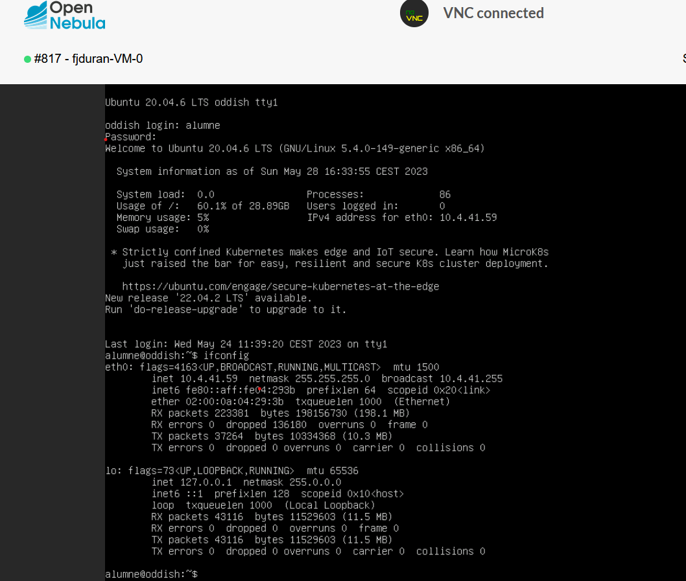
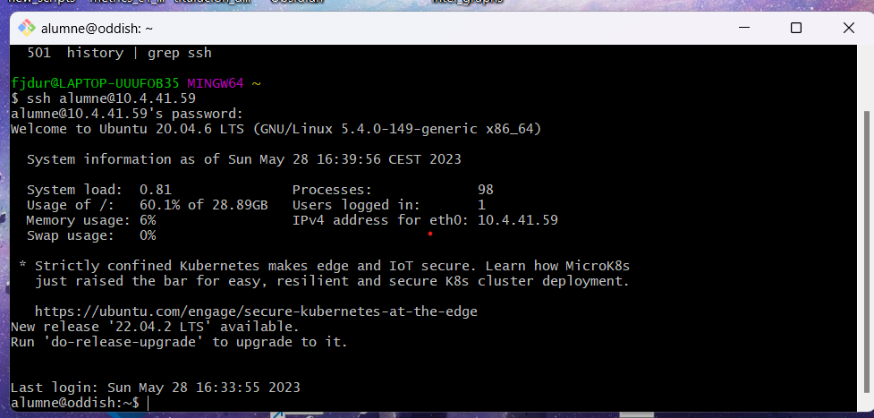

**ToDo:**

- [x] 

-------------------
# Private cloud Virtech setup: How to deploy ML models in a private cloud VM (Virtech)?

1. Get a VM.
- Follow the documentation from https://www.fib.upc.edu/es/la-fib/servicios-tic/cloud-docente-fib.

2. Connect to the VM from local machine.
- Type `ifconfig` to get ip of your VM
- In your local machine you can connect to your VM via SSH:
```shell
        ssh alumne@X.X.X.X
```
- See also [Step 3 How to conect via SSH to remote VM](03_deploy_general.md)

<center><figure>
  </center>
<p style="text-align: center;">Get public IP.</p>

<center><figure>
  </center>
<p style="text-align: center;">SSH connection.</p>

3.  Clone repository. See [03_deploy_general.md: Step 4](03_deploy_general.md)
4.  Set Up the Environment. See [03_deploy_general.md: Step 5](03_deploy_general.md)
5.   Run the API. See [03_deploy_general.md: Step 6](03_deploy_general.md)
6.   Access the API. See [03_deploy_general.md: Step 7](03_deploy_general.md)  
