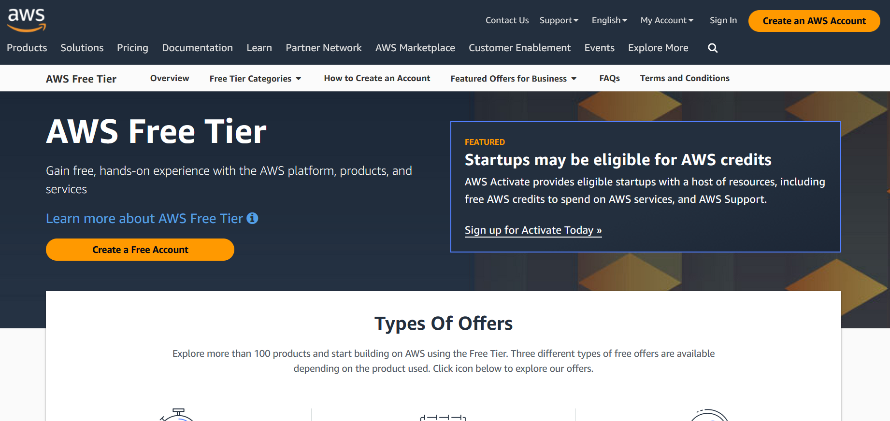
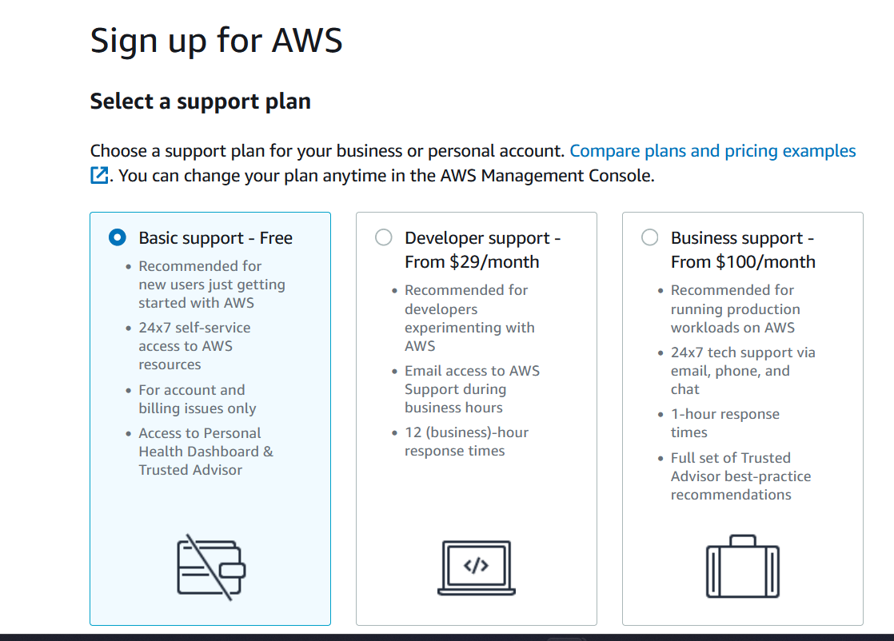
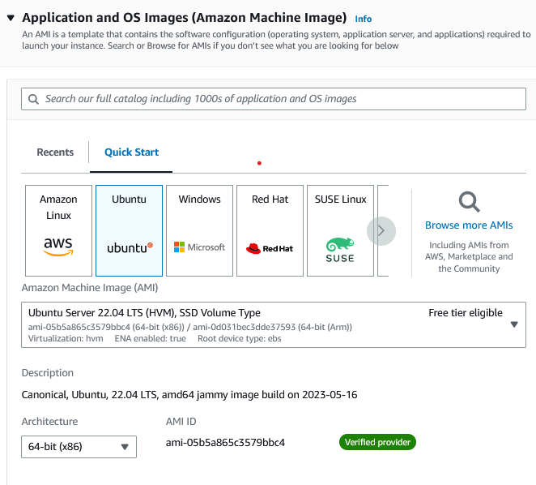
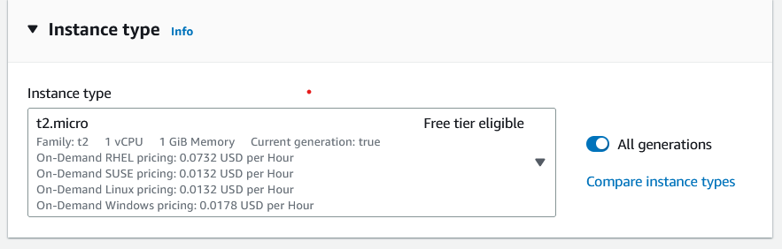
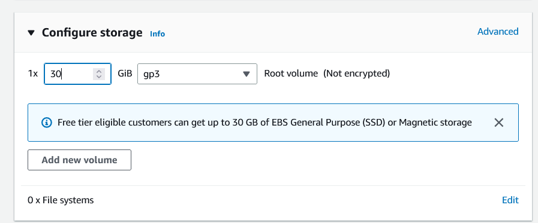

**ToDo:**

- [x] 

-------------------
# AWS setup: How to deploy ML models in a AWS VM?

1. **Get a  [free AWS account](https://aws.amazon.com/free):**

<center><figure>
  </center>
<p style="text-align: center;">AWS free tier account creation.</p>

<center><figure>
  </center>
<p style="text-align: center;">Account type.</p>

2. **Sign in to AWS Console.** 
   - Go to the AWS Management Console (https://console.aws.amazon.com/) and sign in with your AWS account credentials. Sign up if you do not have an account.

3. **Setup budget.**
   - https://aws.amazon.com/getting-started/hands-on/control-your-costs-free-tier-budgets/

4. **Navigate to EC2 Service.** 
   - Once logged in, navigate to the EC2 service by searching for "EC2" in the search bar at the top of the console.

5. **Launch Instance.** 
   - In the EC2 Dashboard, click on the "Launch Instance" button to start the process of launching a new virtual machine.

6. **Select an Amazon Machine Image (AMI).** 
   - Choose an Amazon Machine Image (AMI) from the available options. For a free tier eligible instance, you can choose an image labeled "Free tier eligible" in the AMI selection page.
   - Select an Ubuntu image
<center><figure>
  </center>
<p style="text-align: center;">VM image.</p>

7. **Choose an Instance Type.** 
   - Select the desired instance type that falls under the free tier eligible category. You can review the details and specifications of each instance type to choose the one that suits your requirements. The "t2.micro" instance type is the only free available.

<center><figure>
  </center>
<p style="text-align: center;">Free tier elegible instance.</p>

8. **Configure Instance.** 
   - Configure the instance details, such as the number of instances to launch, network settings, and storage options. Allow SSH traffic and HTTPS traffic from the internet.

9. **Add Storage.** 
   - Specify the storage options for your instance. The default storage size is usually sufficient for basic usage, but you can adjust it according to your needs. We use 30GB in this case.

<center><figure>
  </center>
<p style="text-align: center;">Configure storage.</p>

10.  **Create a Key Pair.** 
     - In the key pair selection page, choose to either create a new key pair or use an existing one. If creating a new key pair, follow the instructions to download the private key file (.pem). This key pair is required to connect to your instance via SSH.

11.  **Review and Launch.** 
     - Review all the settings you have configured for your instance. Double-check if everything looks correct, and then click on the "Launch" button to proceed.

12. **Wait for the virtual machine to be provisioned.**
    - Once it is ready, you can find its details on the EC2>Instances dashboard, including its public IP.

13.  **Access your Instance via SSH.** 
     - Once the instances are launched, you can connect to them using SSH. Open your terminal or SSH client and use the downloaded private key file to establish an SSH connection to your instance. The command typically looks like this:
     ```shell
     ssh -i /path/to/private_key.pem username@public_ip
     ```

     - Replace /path/to/private_key.pem with the actual path to your private key file, username with the appropriate username (depending on the chosen AMI), and public_ip with the public DNS name or IP address of your instance.
     - See also [Step 3](03_deploy_general.md)

14. **Clone repository. See [03_deploy_general.md: Step 4](03_deploy_general.md)**
15. **Set Up the Environment. See [03_deploy_general.md: Step 5](03_deploy_general.md)**
16. **Run the API. See [03_deploy_general.md: Step 6](03_deploy_general.md)**
17. **Access the API. See [03_deploy_general.md: Step 7](03_deploy_general.md)**  


